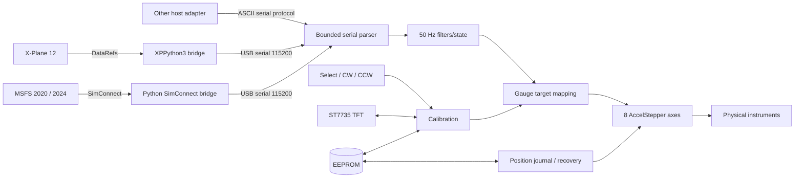

# Cockpit Gauge Controller


A robust Arduino Mega 2560 controller for a physical flight-simulator instrument cluster with **8 independently driven stepper axes**, local calibration controls, TFT feedback, persistent calibration, software-only position recovery, and first-party simulator bridges for **X-Plane 12** and **Microsoft Flight Simulator 2020/2024**.

The core design deliberately separates simulator integration from physical gauge control. Simulator adapters produce a small human-readable serial protocol; the Mega owns real-time stepper servicing, gauge mapping, filtering, calibration, parking, persistence, and recovery.

**XPLDirect is not required.** X-Plane uses the included XPPython3 bridge, while MSFS uses the included external SimConnect bridge. Both drive the same Arduino firmware.

> Current instrument scope: airspeed, turn rate, slip/ball, altitude, barometric setting, directional gyro, heading bug, and vertical speed.

## Simulator support

| Simulator | Included adapter | Integration | Arduino changes required |
| --- | --- | --- | --- |
| X-Plane 12 | `xplane/PI_CockpitGaugeController.py` | XPPython3 + standard DataRefs | No |
| Microsoft Flight Simulator 2020 | `msfs/cockpit_gauge_bridge.py` | SimConnect | No |
| Microsoft Flight Simulator 2024 | `msfs/cockpit_gauge_bridge.py` | SimConnect compatibility layer | No |
| Other simulators | Any custom host adapter | 115200-baud ASCII protocol | No |

## Highlights

| Area | Implementation |
| --- | --- |
| Gauge control | 8 independent `AccelStepper` axes |
| Stepper timing | Non-blocking motor service on every main-loop pass |
| Control timing | Fixed 50 Hz measurement/filter/target loop |
| Heading math | Circular filtering and shortest-path 0°/360° handling |
| Runtime calibration | Per-axis trim with physical buttons while telemetry remains active |
| Calibration persistence | EEPROM-backed trim storage with delayed writes |
| Position recovery | Wear-leveled EEPROM position journal |
| Shutdown state | Clean/unclean position tracking with `PARK` / `SHUTDOWN` |
| Recovery confidence | Explicit `EXACT/TRACKED` vs `ESTIMATED` state |
| Serial reliability | Fixed-size RX buffer; no Arduino `String` in receive path |
| Serial fairness | Bounded bytes processed per loop so RX traffic cannot starve motors |
| Button input | Proper software debounce and hold-repeat behavior |
| Diagnostics | Non-blocking button test and manual BARO service commands |
| Feature control | Compile-time instrument-group toggles |
| Display | ST7735 TFT selected-gauge and trim feedback |
| X-Plane | Included XPPython3 bridge; no XPLDirect dependency |
| MSFS | Included external SimConnect bridge for 2020 and 2024 |
| USB resilience | Auto-detection, reset delay, reconnect and controller-output draining in both bridges |

## Eight controlled axes

The default build enables all eight motor axes:

| Axis | Function | Mega pins |
| --- | --- | --- |
| ASI | Airspeed indicator | D2-D5 |
| TURN | Turn-rate indication | D22-D25 |
| SLIP | Slip / ball indication | D26-D29 |
| VSI | Vertical speed indicator | D30-D33 |
| ALT | Altimeter needle | D34-D37 |
| BARO | Barometric / Kollsman setting | D38-D41 |
| DG | Directional gyro / compass card | D42-D45 |
| BUG | Heading bug | D46-D49 |

These eight axes currently correspond to five physical instrument assemblies: ASI, Turn/Slip, Altimeter/Baro, DG/Heading Bug, and VSI.

## Architecture



`AccelStepper::run()` stays in the unrestricted main loop. Serial parsing, TFT updates, EEPROM activity, and buttons therefore do not become the motor timing clock. Filtering and target generation run on a fixed 20 ms cadence, so smoothing does not vary with CPU load.

## Firmware behavior and reliability

Several implementation details are intentional rather than incidental:

- No dynamic Arduino `String` allocation in the serial RX path.
- Fixed 221-byte receive buffer with overflow rejection.
- Maximum serial work per loop pass is bounded.
- All stepper `run()` calls remain continuously serviced.
- Gauge filtering runs at a deterministic 50 Hz.
- DG and BUG use wrap-safe angular filtering.
- Heading targets use the nearest equivalent revolution to avoid unnecessary full-circle travel.
- Button input is debounced without blocking delays.
- Held calibration buttons repeat after a delay while motor servicing continues.
- `TEST:BUTTONS` is non-blocking.
- Manual BARO override remains active until normal BARO telemetry resumes.
- Calibration EEPROM writes are delayed instead of written on every button event.
- Position snapshots are only written while motors are stationary.
- Position records include version/magic/check information and rotate through EEPROM journal slots.
- A previously clean position record is invalidated before movement.
- Restored positions are held until real simulator telemetry arrives instead of being overwritten by default zero values.
- BARO retains independent speed/acceleration settings.
- Feature toggles compile cleanly without leaving references to disabled gauges.

## Position recovery without homing sensors

The current hardware uses open-loop stepper motors and includes continuously rotating axes, so software cannot physically rediscover an absolute shaft position after arbitrary manual movement or power loss.

Instead, the controller uses a conservative software-only recovery model:

1. Motor positions are continuously tracked in software.
2. Stationary checkpoints are written to a wear-leveled EEPROM journal.
3. Before a motor leaves a trusted clean position, persisted state is marked unclean.
4. `PARK` / `SHUTDOWN` moves enabled gauges to configured park targets.
5. After all movement finishes, a clean snapshot is stored.
6. On reboot, the latest valid position record is restored.
7. Unexpected power loss can restore the latest estimate, but confidence is reported as `ESTIMATED` rather than pretending absolute position is known.
8. `POS:TRUST` marks a visually verified physical/software relationship as authoritative.

For a normal shutdown, send `PARK` or `SHUTDOWN` and wait for:

```text
PARKED. Position saved CLEAN. Safe to power off.
```

See [Calibration and position recovery](docs/CALIBRATION.md).

## Circular heading handling

A normal linear filter mishandles a heading transition such as `359° -> 1°` as a `-358°` jump. DG and heading-bug filtering instead uses shortest angular delta math, so that transition is treated as `+2°`.

The firmware combines:

- normalization to 0..360,
- shortest signed angular delta,
- circular smoothing,
- nearest-equivalent step target selection.

This prevents discontinuities around north and avoids unnecessary rotations.

## Serial protocol

Telemetry is newline-terminated ASCII at **115200 baud**. A complete frame looks like:

```text
IAS:123.4 T:-1.8 S:0.7 ALT:5420 BARO:29.92 HDG:278 BUG:300 VSI:-450
```

| Token | Meaning | Unit |
| --- | --- | --- |
| `IAS:` | Indicated airspeed | knots |
| `T:` | Turn rate | deg/s |
| `S:` | Slip input | degrees |
| `ALT:` | Indicated altitude | feet |
| `BARO:` | Barometric setting | inHg |
| `HDG:` | DG heading | degrees |
| `BUG:` | Heading bug | degrees |
| `VSI:` / `VVI:` | Vertical speed | ft/min |

Service/control commands include:

```text
CAL:ZERO
CAL:SLIPCENTER
CAL:SAVE
CAL:LOAD
TEST:BUTTONS
PARK
SHUTDOWN
RESUME
POS:SAVE
POS:TRUST
POS:STATUS
BAROSTEP:<steps>
BAROSET:<hPa>
```

See [Serial protocol](docs/PROTOCOL.md).

## Local calibration controls

Three active-low buttons use the Mega's internal pull-ups:

| Pin | Function |
| --- | --- |
| D13 | Select next enabled gauge |
| D11 | CW / positive adjustment |
| D12 | CCW / negative adjustment |

Each adjustment changes the selected trim by 64 steps. Holding CW or CCW starts repeat movement after 500 ms and repeats every 100 ms. Calibration remains available while simulator data is streaming.

The ST7735 display shows the selected axis and trim, for example:

```text
SEL: DG
TRIM: -128
```

Trim values persist automatically after a short inactivity delay.

## X-Plane 12 bridge

The included X-Plane adapter runs inside X-Plane through [XPPython3](https://xppython3.readthedocs.io/):

```text
X-Plane 12
    |
    | standard DataRefs
    v
XPPython3 + PI_CockpitGaugeController.py
    |
    | USB serial @ 115200
    v
Arduino Mega
```

It reads the eight values needed by the firmware, sends complete frames at 20 Hz by default, auto-detects Arduino-like ports, reconnects after USB loss, drains controller output to prevent serial back-pressure, sends `RESUME` after connection, and can issue `PARK` when the plugin is disabled.

If `pyserial` is absent, the plugin asks XPPython3's package helper to install it.

Install by copying:

```text
xplane/PI_CockpitGaugeController.py
xplane/CockpitGaugeController/
```

into:

```text
X-Plane 12/Resources/plugins/PythonPlugins/
```

See [X-Plane integration](docs/XPLANE.md).

## Microsoft Flight Simulator 2020 / 2024 bridge

The included MSFS adapter is an external Windows process built on **SimConnect**:

```text
Microsoft Flight Simulator 2020 / 2024
    |
    | SimConnect SimVars
    v
msfs/cockpit_gauge_bridge.py
    |
    | USB serial @ 115200
    v
Arduino Mega
```

It subscribes to:

| Controller | MSFS SimVar |
| --- | --- |
| IAS | `AIRSPEED INDICATED` |
| TURN | `TURN INDICATOR RATE` |
| SLIP | `TURN COORDINATOR BALL` |
| ALT | `INDICATED ALTITUDE` |
| BARO | `KOHLSMAN SETTING HG:1` |
| DG | `PLANE HEADING DEGREES GYRO` |
| BUG | `AUTOPILOT HEADING LOCK DIR` |
| VSI | `VERTICAL SPEED` |

The bridge performs simulator-specific conversion before transmitting:

- turn rate: radians/sec -> degrees/sec,
- vertical speed requested directly as ft/min,
- heading normalized to 0..360,
- MSFS turn-coordinator ball position normalized to the firmware slip input,
- optional independent turn/slip inversion through configuration.

It also provides independent SimConnect and USB reconnect loops, COM-port auto-detection, Arduino reset delay, automatic `RESUME`, continuous controller-output draining, and optional clean `PARK` on exit.

Microsoft documents that legacy MSFS 2020 SimConnect clients continue to work under MSFS 2024. The adapter deliberately stays on that established API subset rather than depending on 2024-only calls.

### Install the MSFS bridge

On the Windows machine running MSFS:

```powershell
cd msfs
py -m venv .venv
.\.venv\Scripts\activate
python -m pip install -r requirements.txt
python cockpit_gauge_bridge.py
```

The launch order is not critical: the bridge keeps retrying both SimConnect and serial independently.

See [Microsoft Flight Simulator integration](docs/MSFS.md).

## Hardware

### Core components

- Arduino Mega 2560
- 28BYJ-48-style 4-phase stepper motors or mechanically equivalent arrangements
- ULN2003-type driver boards or equivalent suitable motor drivers
- ST7735 160x80 TFT
- 3 momentary push buttons
- Optional heartbeat LED on D10

Do **not** drive stepper coils directly from the Arduino pins.

### TFT wiring

The TFT uses the Mega hardware SPI bus:

| TFT signal | Mega pin |
| --- | --- |
| SCK | D52 |
| MOSI | D51 |
| CS | A9 |
| DC | A8 |
| RST | A10 |

`A10` and digital `D10` are different Mega pins. D10 is only the optional heartbeat output.

See [Wiring](docs/WIRING.md) for the complete pin map.

## Dependencies

### Arduino firmware

- [AccelStepper](https://www.airspayce.com/mikem/arduino/AccelStepper/)
- [Adafruit GFX Library](https://github.com/adafruit/Adafruit-GFX-Library)
- [Adafruit ST7735 and ST7789 Library](https://github.com/adafruit/Adafruit-ST7735-Library)
- Arduino core `SPI`
- Arduino core `EEPROM`

### X-Plane bridge

- [XPPython3](https://xppython3.readthedocs.io/) 4.x
- `pyserial>=3.5`

### MSFS bridge

- 64-bit Python 3 on Windows
- `pysimconnect==0.2.6`
- `pyserial>=3.5,<4`

The Python dependencies are not vendored.

## Build and upload firmware

1. Install Arduino IDE.
2. Select **Arduino Mega or Mega 2560**.
3. Install the Arduino libraries listed above.
4. Open `firmware/CockpitGaugeController/CockpitGaugeController.ino`.
5. Select the correct serial port.
6. Compile and upload.
7. Connect at 115200 baud.
8. Use `POS:STATUS` before trusting restored position after mechanical changes or manual needle movement.

## First calibration

For a new build or after mechanically changing an instrument:

1. Power the controller and let the motors settle.
2. Feed known simulator values.
3. Use Select/CW/CCW to align each instrument.
4. Allow delayed calibration persistence or send `CAL:SAVE`.
5. Visually verify that physical indications match simulator values.
6. When all motors are stopped, send `POS:TRUST`.
7. Use `PARK` / `SHUTDOWN` for normal power-off.

## Compile-time configuration

Optional instrument groups can be disabled near the top of the sketch:

```cpp
#define ENABLE_TURN_SLIP 1
#define ENABLE_ALT       1
#define ENABLE_BARO      1
#define ENABLE_DG        1
#define ENABLE_VSI       1
```

The selector skips disabled axes and the code is guarded so these configurations compile cleanly.

Each mechanism also has its own effective steps-per-revolution value rather than forcing one global gearbox assumption:

```cpp
constexpr float IAS_STEPS_PER_REV  = 4096.0f;
constexpr float TURN_STEPS_PER_REV = 4096.0f;
constexpr float SLIP_STEPS_PER_REV = 4096.0f;
constexpr float ALT_STEPS_PER_REV  = 4096.0f;
constexpr float DG_STEPS_PER_REV   = 4096.0f;
constexpr float BUG_STEPS_PER_REV  = 4096.0f;
constexpr float VSI_STEPS_PER_REV  = 4096.0f;
```

This allows per-mechanism correction for real gearbox and printed-mechanism variation.

## Repository layout

```text
CockpitGaugeController/
├── firmware/
│   └── CockpitGaugeController/
│       └── CockpitGaugeController.ino
├── xplane/
│   ├── PI_CockpitGaugeController.py
│   └── CockpitGaugeController/
│       └── config.json
├── msfs/
│   ├── cockpit_gauge_bridge.py
│   ├── config.json
│   └── requirements.txt
├── docs/
│   ├── WIRING.md
│   ├── PROTOCOL.md
│   ├── CALIBRATION.md
│   ├── XPLANE.md
│   └── MSFS.md
├── NOTICE.md
├── LICENSE
└── README.md
```

## Mechanical design credit

The physical gauge mechanisms and 3D-printable instrument designs used as the basis for this build are based on work by **Martin Rusk** in [MartinRusk/Sixpack](https://github.com/MartinRusk/Sixpack) and the associated Printables models.

The firmware and simulator bridges in this repository are a separate implementation. This repository is **not a fork of the Sixpack firmware codebase** and does not redistribute Martin Rusk's firmware or 3D model files.

Relevant original designs:

- [Airspeed indicator](https://www.printables.com/model/338749-airspeed-indicator-for-flight-simulation)
- [Altimeter](https://www.printables.com/model/341603-altimeter-for-flight-simulation)
- [Variometer / VSI](https://www.printables.com/model/338636-variometer-for-flight-simulation)
- [Gyro compass](https://www.printables.com/model/356101-gyro-compass-for-flight-simulation)
- [Turn coordinator](https://www.printables.com/model/357184-turn-coordinator-for-flight-simulation)

See [NOTICE.md](NOTICE.md) for attribution and third-party dependency details.

## License

The firmware, simulator bridges, and original documentation in this repository are released under **GNU GPL v2.0 only (GPL-2.0-only)**. See [LICENSE](LICENSE).

Third-party libraries, simulator APIs, and referenced mechanical designs remain under their own licenses.
