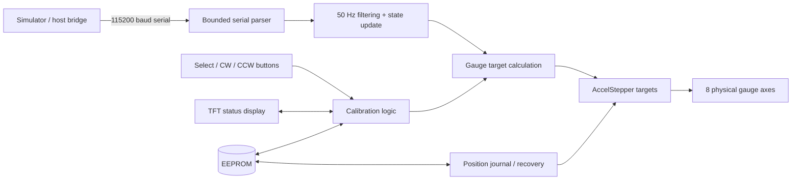

# Cockpit Gauge Controller


Robust Arduino Mega 2560 firmware for driving a physical flight-simulator instrument cluster with eight stepper-controlled axes, local calibration controls, a TFT status display, persistent calibration, and software-only position recovery.

The firmware deliberately keeps the simulator-facing side simple: a host application sends human-readable telemetry over serial, while the Arduino handles motion, filtering, calibration, position tracking, parking, and recovery. This keeps the gauge controller independent from any one simulator plugin or desktop stack.

> **Current scope:** airspeed, turn rate, slip, altimeter, barometric setting, directional gyro, heading bug, and vertical speed.

## Highlights

| Area | Implementation |
| --- | --- |
| Gauge control | 8 independent `AccelStepper` axes |
| Motion servicing | Non-blocking stepper service on every main-loop pass |
| Control timing | Fixed 50 Hz measurement/filter/target loop |
| Heading handling | Circular smoothing and shortest-path wrap logic for 0°/360° transitions |
| Calibration | Per-axis trim with physical buttons and TFT feedback |
| Persistence | EEPROM-backed trim storage with delayed writes |
| Position recovery | Wear-leveled EEPROM position journal with clean/unclean state tracking |
| Power-down workflow | `PARK` / `SHUTDOWN` command with confirmed clean position snapshot |
| Recovery confidence | Explicit `EXACT/TRACKED` vs `ESTIMATED` position state |
| Serial reliability | Fixed-size RX buffer, no Arduino `String`, bounded bytes processed per loop |
| Runtime calibration | Buttons continue working while live simulator telemetry is arriving |
| Debug tools | Non-blocking button test and manual BARO movement commands |
| Modularity | Compile-time feature toggles for instrument groups |
| Display | ST7735 TFT shows selected gauge and live trim value |

## Supported gauge axes

The default build enables all eight axes:

| Axis | Function | Default pins |
| --- | --- | --- |
| ASI | Airspeed indicator | D2-D5 |
| TURN | Turn-rate indication | D22-D25 |
| SLIP | Slip / ball indication | D26-D29 |
| VSI | Vertical speed indicator | D30-D33 |
| ALT | Altimeter needle | D34-D37 |
| BARO | Barometric/Kollsman setting | D38-D41 |
| DG | Directional gyro / compass card | D42-D45 |
| BUG | Heading bug | D46-D49 |

This corresponds to five physical instrument assemblies in the current build: ASI, Turn/Slip, Altimeter/Baro, DG/Heading Bug, and VSI.

## Why the firmware is structured this way

The firmware separates work that must run frequently from work that should run at a deterministic rate:



`AccelStepper::run()` remains in the unrestricted main loop so serial parsing, display work, EEPROM writes, and button handling do not become the motor timing clock. Filtering and target calculation run at a fixed 20 ms interval, so smoothing behavior does not change with CPU load.

## Position recovery without homing sensors

The current hardware uses open-loop steppers and continuous-rotation axes, so firmware alone cannot physically rediscover an absolute shaft angle after an arbitrary movement or power loss. Instead, this project implements a conservative software-only recovery model:

- Current motor positions are tracked continuously in software.
- Position snapshots are written to a wear-leveled EEPROM journal only while all motors are stationary.
- A clean saved state is invalidated before movement starts.
- `PARK` / `SHUTDOWN` moves gauges to configured park targets and writes a clean position record.
- On reboot, the latest valid record is restored before normal motion begins.
- Unexpected power loss restores the best available checkpoint but marks confidence as `ESTIMATED` when appropriate.
- `POS:TRUST` explicitly marks a visually verified physical/software relationship as authoritative.

This avoids pretending that software has absolute feedback when it does not. See [Position recovery and calibration](docs/CALIBRATION.md) for the recommended workflow.

## Circular heading logic

DG and heading-bug values are not filtered with ordinary linear subtraction. A transition such as `359° -> 1°` is treated as a +2° change rather than a -358° change.

The firmware combines:

- wrap-to-360 normalization,
- shortest angular delta filtering,
- nearest equivalent step target selection.

This prevents unnecessary full-circle motion and discontinuities around north.

## Serial protocol

Telemetry is newline-terminated ASCII at **115200 baud**. Multiple values can be sent in one line:

```text
IAS:123.4 T:-1.8 S:0.7 ALT:5420 BARO:29.92 HDG:278 BUG:300 VSI:-450
```

Supported telemetry tokens:

| Token | Meaning | Unit |
| --- | --- | --- |
| `IAS:` | Indicated airspeed | knots |
| `T:` | Turn value | degrees / configured source unit |
| `S:` | Slip value | degrees |
| `ALT:` | Altitude | feet |
| `BARO:` | Barometric setting | inHg |
| `HDG:` | Heading | degrees |
| `BUG:` | Heading bug | degrees |
| `VSI:` / `VVI:` | Vertical speed | ft/min |

Control and service commands include:

```text
CAL:ZERO
CAL:SLIPCENTER
CAL:SAVE
CAL:LOAD
TEST:BUTTONS
PARK
SHUTDOWN
RESUME
POS:SAVE
POS:TRUST
POS:STATUS
BAROSTEP:<steps>
BAROSET:<hPa>
```

See [Serial protocol](docs/PROTOCOL.md) for exact behavior.

## Local calibration controls

Three active-low buttons use the Mega's internal pull-ups:

| Pin | Control |
| --- | --- |
| D13 | Select next enabled gauge |
| D11 | Adjust selected gauge clockwise / positive |
| D12 | Adjust selected gauge counter-clockwise / negative |

Each adjustment changes trim by 64 steps. Holding an adjustment button starts repeat movement after 500 ms and repeats every 100 ms. Inputs are debounced in software.

The ST7735 display shows the selected axis and trim value, for example:

```text
SEL: DG
TRIM: -128
```

Calibration changes are saved to EEPROM after a short inactivity delay instead of on every button event.

## Hardware

### Core

- Arduino Mega 2560
- 28BYJ-48-style 4-phase stepper motors or mechanically equivalent four-wire/driver arrangements supported by the current scaling
- ULN2003-type driver boards or equivalent motor drivers
- ST7735 160x80 TFT
- 3 momentary push buttons
- Optional external heartbeat LED on D10

Do **not** drive stepper coils directly from the Arduino pins. Use suitable driver hardware and an appropriate motor supply.

### TFT wiring

The display uses the Mega's hardware SPI bus:

| TFT signal | Mega pin |
| --- | --- |
| SCK | D52 |
| MOSI | D51 |
| CS | A9 |
| DC | A8 |
| RST | A10 |

`A10` and digital `D10` are different Mega pins. `D10` is only the optional heartbeat output.

For the complete map, see [Wiring](docs/WIRING.md).

## Software dependencies

Install these Arduino libraries:

- [AccelStepper](https://www.airspayce.com/mikem/arduino/AccelStepper/)
- [Adafruit GFX Library](https://github.com/adafruit/Adafruit-GFX-Library)
- [Adafruit ST7735 and ST7789 Library](https://github.com/adafruit/Adafruit-ST7735-Library)

The firmware also uses Arduino core libraries `SPI` and `EEPROM`.

## Build and upload

1. Install the Arduino IDE and select **Arduino Mega or Mega 2560**.
2. Install the libraries listed above.
3. Open `firmware/CockpitGaugeController/CockpitGaugeController.ino`.
4. Select the correct serial port.
5. Compile and upload.
6. Open a serial connection at **115200 baud**.
7. Check `POS:STATUS` before relying on a restored position after changing hardware or manually rotating a gauge.

## First calibration

For a new build or after mechanically changing an instrument:

1. Power the controller and let the motors settle.
2. Feed known simulator values to the gauges.
3. Use Select/CW/CCW to align each physical indication.
4. Save or allow the delayed EEPROM trim save to complete.
5. Visually verify that software values and physical positions agree.
6. Send `POS:TRUST` while all gauges are stopped.
7. For normal power-down, send `PARK` or `SHUTDOWN` and wait for:

```text
PARKED. Position saved CLEAN. Safe to power off.
```

Then remove power.

## Compile-time configuration

Instrument groups can be disabled near the top of the sketch:

```cpp
#define ENABLE_TURN_SLIP 1
#define ENABLE_ALT       1
#define ENABLE_BARO      1
#define ENABLE_DG        1
#define ENABLE_VSI       1
```

The gauge selector skips disabled axes and the firmware is structured so feature toggles do not leave unresolved references elsewhere in the code.

Individual motor scaling is also separated per axis:

```cpp
constexpr float IAS_STEPS_PER_REV  = 4096.0f;
constexpr float TURN_STEPS_PER_REV = 4096.0f;
constexpr float SLIP_STEPS_PER_REV = 4096.0f;
constexpr float ALT_STEPS_PER_REV  = 4096.0f;
constexpr float DG_STEPS_PER_REV   = 4096.0f;
constexpr float BUG_STEPS_PER_REV  = 4096.0f;
constexpr float VSI_STEPS_PER_REV  = 4096.0f;
```

That allows each mechanism to be calibrated independently instead of assuming every gearbox has an identical effective ratio.

## Reliability-oriented implementation details

Several implementation choices are intentional:

- No Arduino `String` allocation in the serial receive path.
- RX lines use a fixed 221-byte buffer with explicit overflow handling.
- Serial processing is capped per main-loop pass so a burst cannot monopolize motor servicing.
- The button diagnostic mode is non-blocking.
- Manual BARO debug mode remains active until normal BARO telemetry resumes.
- EEPROM calibration writes use delayed persistence.
- Position records include magic/version fields and checksums.
- Position records rotate through available EEPROM journal slots rather than repeatedly overwriting one record.
- EEPROM position snapshots are made only when motors are stopped.
- A clean position snapshot is invalidated before movement.
- Startup restores tracked positions before accepting normal target updates.
- Restored positions are held until real simulator data arrives instead of being overwritten by zero-initialized measurements.
- BARO has independent speed/acceleration limits.
- DG/BUG heading smoothing is wrap-safe.

## Repository layout

```text
CockpitGaugeController/
├── firmware/
│   └── CockpitGaugeController/
│       └── CockpitGaugeController.ino
├── docs/
│   ├── CALIBRATION.md
│   ├── PROTOCOL.md
│   └── WIRING.md
├── NOTICE.md
├── LICENSE
└── README.md
```

## Mechanical design credit

The physical gauge mechanisms and 3D-printable instrument designs used as the basis for this build are based on work by **Martin Rusk** in the [MartinRusk/Sixpack](https://github.com/MartinRusk/Sixpack) project and its associated Printables models.

The firmware in this repository is a separate implementation. It is **not a fork of the Sixpack firmware codebase** and does not include Martin Rusk's firmware source or 3D model files.

Relevant original physical designs include:

- [Airspeed indicator](https://www.printables.com/model/338749-airspeed-indicator-for-flight-simulation)
- [Altimeter](https://www.printables.com/model/341603-altimeter-for-flight-simulation)
- [Variometer / VSI](https://www.printables.com/model/338636-variometer-for-flight-simulation)
- [Gyro compass](https://www.printables.com/model/356101-gyro-compass-for-flight-simulation)
- [Turn coordinator](https://www.printables.com/model/357184-turn-coordinator-for-flight-simulation)

See [NOTICE.md](NOTICE.md) for attribution details. The original 3D files are not redistributed here; their own licenses remain with their respective authors/pages.

## License

The firmware and original documentation in this repository are released under **GNU GPL v2.0 only**. See [LICENSE](LICENSE).

This choice is compatible with the open-source licensing model of the AccelStepper dependency used by the firmware. Third-party libraries, referenced 3D designs, and other external materials remain under their respective licenses.

## Status

The current firmware targets an Arduino Mega 2560 and the existing eight-axis hardware layout. The serial boundary is intentionally simple enough that a host bridge can be written for X-Plane or another simulator without changing the motor-control architecture.
